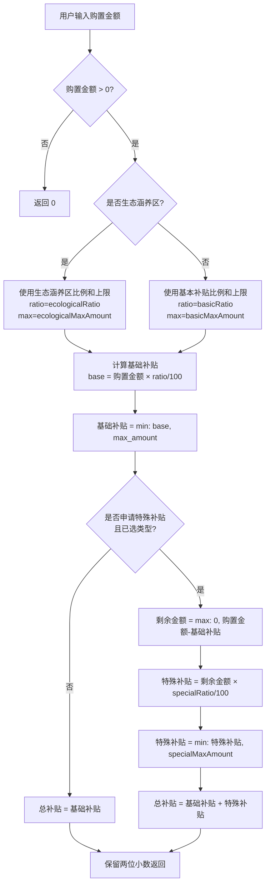

# 补贴金额计算算法深度分析

## 1. 系统架构总览

补贴金额计算在本系统中是 **前端驱动计算** 的设计：
- **后端**：负责存储和提供补贴比例配置数据（`agri-module-subsidy`）、区域生态涵养标识（`system_area`）
- **前端**：在 `DeviceInfo.vue` 组件中根据配置参数和用户输入实时计算预计补贴金额
- **数据流**：用户输入购置金额 → 前端获取补贴配置 + 判断区域类型 → 前端计算预计补贴 → 结果与表单一起保存到后端

> [!IMPORTANT]
> 补贴金额不是后端计算的，而是前端实时计算后作为表单字段提交保存。测试脚本需要模拟这个前端计算逻辑来验证结果。

---

## 2. 补贴类型枚举

文件：[SubsidyTypeEnum.java](file:///c:/Users/first/Desktop/workspace/warm_backend/agri-module-system/agri-module-system-api/src/main/java/com/info/agri/module/system/enums/subsidy/SubsidyTypeEnum.java)

| 枚举值 | Code | 名称 | 说明 |
|--------|------|------|------|
| `BASIC` | `"BASIC"` | 基本补贴 | 非生态涵养区的默认补贴 |
| `ECOLOGICAL` | `"ECOLOGICAL"` | 生态涵养区补贴 | 生态涵养区的专属补贴（与基本补贴互斥） |
| `SPECIAL` | `"SPECIAL"` | 特殊补贴 | 可叠加在基本/生态补贴之上 |

---

## 3. 补贴比例配置数据模型

### 3.1 数据库表：`system_subsidy_ratio`

文件：[SubsidyRatioDO.java](file:///c:/Users/first/Desktop/workspace/warm_backend/agri-module-subsidy/agri-module-subsidy-biz/src/main/java/com/info/agri/module/subsidy/dal/dataobject/subsidyratio/SubsidyRatioDO.java)

| 字段 | 类型 | 说明 |
|------|------|------|
| `id` | Long | 主键 |
| `subsidyType` | SubsidyTypeEnum | 补贴类型（BASIC/ECOLOGICAL/SPECIAL） |
| `subsidyRatio` | BigDecimal | 补贴比例（%），例如 80 代表 80% |
| `maxSubsidyAmount` | BigDecimal | 最高补贴金额（元），例如 4800 |
| `tenantId` | Long | 租户ID |

### 3.2 API 返回的聚合配置

文件：[AllConfigRespVO.java](file:///c:/Users/first/Desktop/workspace/warm_backend/agri-module-subsidy/agri-module-subsidy-biz/src/main/java/com/info/agri/module/subsidy/controller/admin/subsidyratio/vo/AllConfigRespVO.java)

```json
{
  "basicRatio": 80,           // 基本补贴比例（%）
  "basicMaxAmount": 4800,     // 基本补贴最高金额（元）
  "ecologicalRatio": 90,      // 生态涵养区补贴比例（%）
  "ecologicalMaxAmount": 5400, // 生态涵养区最高金额（元）
  "specialRatio": 100,        // 特殊补贴比例（%）
  "specialMaxAmount": 6000    // 特殊补贴最高金额（元）
}
```

---

## 4. 核心计算算法 ⭐

### 4.1 计算公式（伪代码）

文件：[DeviceInfo.vue:813-861](file:///c:/Users/first/Desktop/workspace/warm_fontend/src/views/cleanEnergy/components/form/DeviceInfo.vue#L813-L861)

```python
def calculate_estimated_subsidy(purchase_amount, is_ecological, is_special_subsidy, has_special_type, config):
    """
    计算预计补贴金额
    
    参数：
    - purchase_amount: 设备购置总金额（元）
    - is_ecological: 是否属于生态涵养区
    - is_special_subsidy: 是否申请特殊补贴（'1' 为是）
    - has_special_type: 是否已选择特殊补贴申报类型
    - config: 补贴配置（从 API 获取）
    """
    
    if purchase_amount <= 0:
        return 0
    
    # ======== 第一步：确定基础补贴比例和上限 ========
    # 基本补贴 和 生态涵养区补贴 互斥，只能生效一个
    if is_ecological:
        ratio = config.ecologicalRatio        # 如 90
        max_amount = config.ecologicalMaxAmount  # 如 5400
    else:
        ratio = config.basicRatio             # 如 80
        max_amount = config.basicMaxAmount    # 如 4800
    
    # ======== 第二步：计算基础补贴金额 ========
    base_subsidy = purchase_amount * (ratio / 100)
    base_subsidy = min(base_subsidy, max_amount)  # 不超过最高限额
    
    total_subsidy = base_subsidy
    
    # ======== 第三步：叠加特殊补贴（条件满足时） ========
    # 用户选择"是"且已选择特殊补贴申报类型后才计入
    if is_special_subsidy and has_special_type:
        remaining = max(0, purchase_amount - base_subsidy)  # 剩余金额
        special_subsidy = remaining * (config.specialRatio / 100)
        special_subsidy = min(special_subsidy, config.specialMaxAmount)  # 不超过特殊补贴上限
        total_subsidy = base_subsidy + special_subsidy
    
    # ======== 第四步：四舍五入保留两位小数 ========
    return round(total_subsidy * 100) / 100
```

### 4.2 计算流程图



---

## 5. 关键判断条件

### 5.1 生态涵养区判断

文件：[DeviceInfo.vue:788-810](file:///c:/Users/first/Desktop/workspace/warm_fontend/src/views/cleanEnergy/components/form/DeviceInfo.vue#L788-L810)

```javascript
// 生态涵养区判断逻辑：
// 1. 从 API /system/subsidy-ratio/district-list 获取区域列表
// 2. 每条记录有 isEcological 字段（1=生态涵养区，0=非生态涵养区）
// 3. 通过 formData 中的 districtId 或 townId 匹配
// 4. 匹配到且 isEcological === 1 则为生态涵养区
```

### 5.2 特殊补贴判断

```javascript
// 特殊补贴条件（两个条件同时满足才计算）：
// 条件1：is_special_subsidy / update_is_special_subsidy === '1' 或 1 或 true
// 条件2：special_subsidy_type / update_special_subsidy_type 不为空
```

### 5.3 表单类型适配

| 表单类型 | formCode | 字段前缀 | 购置金额字段 | 预计补贴字段 |
|---------|----------|---------|------------|------------|
| 设备新增补贴 | `EQUIPMENT_SUBSIDY` | 无 | `purchase_amount` | `estimated_subsidy` |
| 设备更新补贴 | `EQUIPMENT_UPDATE` | `update_` | `update_purchase_amount` | `update_estimated_subsidy` |

---

## 6. API 接口汇总

### 6.1 补贴配置相关

| 接口 | 方法 | 路径 | 说明 |
|------|------|------|------|
| 获取所有配置 | GET | `/system/subsidy-ratio/get-all` | 返回三类补贴的比例和上限 |
| 批量更新配置 | POST | `/system/subsidy-ratio/batch-update` | 同时更新三类配置 |
| 获取区域列表 | GET | `/system/subsidy-ratio/district-list` | 返回区域及其生态涵养区标识 |

### 6.2 表单数据相关

| 接口 | 方法 | 路径 | 说明 |
|------|------|------|------|
| 获取申报表单配置 | GET | `/system/form/declaration-form` | 获取某区的表单字段配置 |
| 提交表单 | POST | `/system/form/data/submit` | 提交包含补贴金额的完整表单 |
| 保存草稿 | POST | `/system/form/data/create` | 保存草稿 |
| 获取表单详情 | GET | `/system/form/data/detail` | 获取已保存的表单详情 |

---

## 7. 计算示例

### 示例1：普通区域，不申请特殊补贴

```
输入：
  购置金额 = 5000 元
  是否生态涵养区 = 否
  是否特殊补贴 = 否
  
配置：basicRatio=80, basicMaxAmount=4800

计算：
  基础补贴 = 5000 × 80/100 = 4000
  min(4000, 4800) = 4000
  
结果：预计补贴 = 4000.00 元
```

### 示例2：普通区域，购置金额较高触发上限

```
输入：
  购置金额 = 10000 元
  是否生态涵养区 = 否
  是否特殊补贴 = 否
  
配置：basicRatio=80, basicMaxAmount=4800

计算：
  基础补贴 = 10000 × 80/100 = 8000
  min(8000, 4800) = 4800  ⬅️ 触发上限
  
结果：预计补贴 = 4800.00 元
```

### 示例3：生态涵养区，不申请特殊补贴

```
输入：
  购置金额 = 5000 元
  是否生态涵养区 = 是
  是否特殊补贴 = 否
  
配置：ecologicalRatio=90, ecologicalMaxAmount=5400

计算：
  基础补贴 = 5000 × 90/100 = 4500
  min(4500, 5400) = 4500
  
结果：预计补贴 = 4500.00 元
```

### 示例4：普通区域，申请特殊补贴

```
输入：
  购置金额 = 5000 元
  是否生态涵养区 = 否
  is_special_subsidy = '1'
  special_subsidy_type = '某类型'
  
配置：basicRatio=80, basicMaxAmount=4800, specialRatio=100, specialMaxAmount=6000

计算：
  基础补贴 = 5000 × 80/100 = 4000
  min(4000, 4800) = 4000
  
  剩余金额 = max(0, 5000 - 4000) = 1000
  特殊补贴 = 1000 × 100/100 = 1000
  min(1000, 6000) = 1000
  
  总补贴 = 4000 + 1000 = 5000
  
结果：预计补贴 = 5000.00 元
```

### 示例5：生态涵养区 + 特殊补贴 + 触发上限

```
输入：
  购置金额 = 10000 元
  是否生态涵养区 = 是
  is_special_subsidy = '1'
  special_subsidy_type = '某类型'
  
配置：ecologicalRatio=90, ecologicalMaxAmount=5400, specialRatio=100, specialMaxAmount=6000

计算：
  基础补贴 = 10000 × 90/100 = 9000
  min(9000, 5400) = 5400  ⬅️ 触发生态涵养区上限
  
  剩余金额 = max(0, 10000 - 5400) = 4600
  特殊补贴 = 4600 × 100/100 = 4600
  min(4600, 6000) = 4600
  
  总补贴 = 5400 + 4600 = 10000
  
结果：预计补贴 = 10000.00 元
```

---

## 8. 测试脚本设计建议

### 8.1 前置条件获取

```python
# 1. 获取当前补贴配置
# GET /system/subsidy-ratio/get-all
# 响应示例：{ basicRatio, basicMaxAmount, ecologicalRatio, ecologicalMaxAmount, specialRatio, specialMaxAmount }

# 2. 获取区域列表和生态涵养区标识
# GET /system/subsidy-ratio/district-list
# 响应示例：[{ id, name, isEcological }]
```

### 8.2 测试用例矩阵

| # | 购置金额 | 区域类型 | 特殊补贴 | 预期行为 |
|---|---------|---------|---------|---------|
| 1 | 0 | 普通 | 否 | 返回 0 |
| 2 | 负数 | 普通 | 否 | 返回 0 |
| 3 | 3000 | 普通 | 否 | 购置金额 × basicRatio% |
| 4 | 大额（触发上限） | 普通 | 否 | 返回 basicMaxAmount |
| 5 | 3000 | 生态涵养区 | 否 | 购置金额 × ecologicalRatio% |
| 6 | 大额（触发上限） | 生态涵养区 | 否 | 返回 ecologicalMaxAmount |
| 7 | 5000 | 普通 | 是+选类型 | 基础补贴 + 特殊补贴 |
| 8 | 5000 | 普通 | 是+未选类型 | 仅基础补贴（特殊补贴不计入） |
| 9 | 5000 | 生态涵养区 | 是+选类型 | 生态涵养区基础 + 特殊补贴 |
| 10 | 大额 | 普通 | 是+选类型 | 基础触发上限 + 特殊触发上限 |
| 11 | 小数金额 | 普通 | 否 | 保留两位小数 |

### 8.3 测试脚本核心计算函数（Python）

```python
import math

def calculate_estimated_subsidy(
    purchase_amount: float,
    is_ecological: bool,
    is_special_subsidy: bool,
    has_special_type: bool,
    config: dict
) -> float:
    """
    预计补贴金额计算（复刻前端算法）
    
    Args:
        purchase_amount: 设备购置总金额（元）
        is_ecological: 是否生态涵养区
        is_special_subsidy: 是否申请特殊补贴
        has_special_type: 是否已选择特殊补贴类型
        config: 补贴配置字典，包含：
            - basicRatio, basicMaxAmount
            - ecologicalRatio, ecologicalMaxAmount
            - specialRatio, specialMaxAmount
    
    Returns:
        预计补贴金额（保留两位小数）
    """
    if purchase_amount <= 0:
        return 0
    
    # 第一步：确定基础比例和上限（基本 vs 生态互斥）
    if is_ecological:
        ratio = config['ecologicalRatio']
        max_amount = config['ecologicalMaxAmount']
    else:
        ratio = config['basicRatio']
        max_amount = config['basicMaxAmount']
    
    # 第二步：计算基础补贴
    base_subsidy = purchase_amount * (ratio / 100)
    base_subsidy = min(base_subsidy, max_amount)
    
    total_subsidy = base_subsidy
    
    # 第三步：特殊补贴叠加
    if is_special_subsidy and has_special_type:
        remaining = max(0, purchase_amount - base_subsidy)
        special_subsidy = remaining * (config['specialRatio'] / 100)
        special_subsidy = min(special_subsidy, config['specialMaxAmount'])
        total_subsidy = base_subsidy + special_subsidy
    
    # 第四步：保留两位小数（与 JS Math.round(x*100)/100 一致）
    return math.floor(total_subsidy * 100 + 0.5) / 100
```

### 8.4 关键注意事项

> [!WARNING]
> 1. **精度问题**：前端使用 `Math.round(totalSubsidy * 100) / 100`，Python 测试需要用 `round()` 函数或等价方式，注意浮点数精度差异
> 2. **补贴配置是动态的**：测试前必须先通过 API 获取当前有效的补贴配置，不能硬编码
> 3. **生态涵养区判断依赖区域数据**：需要通过 API 获取区域列表及其 `isEcological` 标识
> 4. **表单类型区分**：设备新增(`EQUIPMENT_SUBSIDY`)和设备更新(`EQUIPMENT_UPDATE`)使用不同的字段名前缀
> 5. **特殊补贴是对"剩余金额"再按比例计算**，不是对购置金额整体再算一次

---

## 9. 文件索引

| 文件 | 作用 |
|------|------|
| [SubsidyTypeEnum.java](file:///c:/Users/first/Desktop/workspace/warm_backend/agri-module-system/agri-module-system-api/src/main/java/com/info/agri/module/system/enums/subsidy/SubsidyTypeEnum.java) | 补贴类型枚举定义 |
| [SubsidyRatioDO.java](file:///c:/Users/first/Desktop/workspace/warm_backend/agri-module-subsidy/agri-module-subsidy-biz/src/main/java/com/info/agri/module/subsidy/dal/dataobject/subsidyratio/SubsidyRatioDO.java) | 补贴配置数据模型 |
| [SubsidyRatioServiceImpl.java](file:///c:/Users/first/Desktop/workspace/warm_backend/agri-module-subsidy/agri-module-subsidy-biz/src/main/java/com/info/agri/module/subsidy/service/subsidyratio/SubsidyRatioServiceImpl.java) | 补贴配置 CRUD 服务 |
| [SubsidyRatioController.java](file:///c:/Users/first/Desktop/workspace/warm_backend/agri-module-subsidy/agri-module-subsidy-biz/src/main/java/com/info/agri/module/subsidy/controller/admin/subsidyratio/SubsidyRatioController.java) | 补贴配置 REST API |
| [AllConfigRespVO.java](file:///c:/Users/first/Desktop/workspace/warm_backend/agri-module-subsidy/agri-module-subsidy-biz/src/main/java/com/info/agri/module/subsidy/controller/admin/subsidyratio/vo/AllConfigRespVO.java) | 配置聚合响应 VO |
| [BatchUpdateReqVO.java](file:///c:/Users/first/Desktop/workspace/warm_backend/agri-module-subsidy/agri-module-subsidy-biz/src/main/java/com/info/agri/module/subsidy/controller/admin/subsidyratio/vo/BatchUpdateReqVO.java) | 批量更新请求 VO |
| [FormInitController.java](file:///c:/Users/first/Desktop/workspace/warm_backend/agri-module-declaration/agri-module-declaration-biz/src/main/java/com/info/agri/module/declaration/controller/admin/form/FormInitController.java) | 表单字段模板定义 |
| [DeviceInfo.vue](file:///c:/Users/first/Desktop/workspace/warm_fontend/src/views/cleanEnergy/components/form/DeviceInfo.vue) | **核心计算逻辑所在** |
